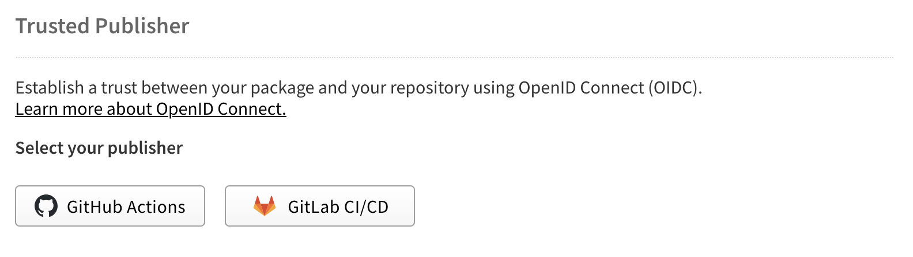
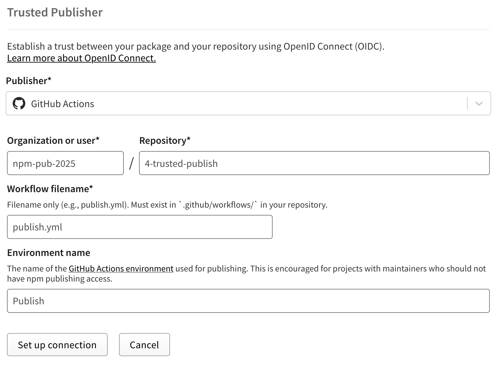
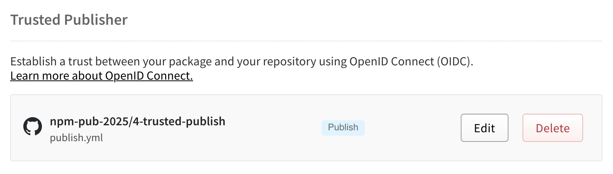
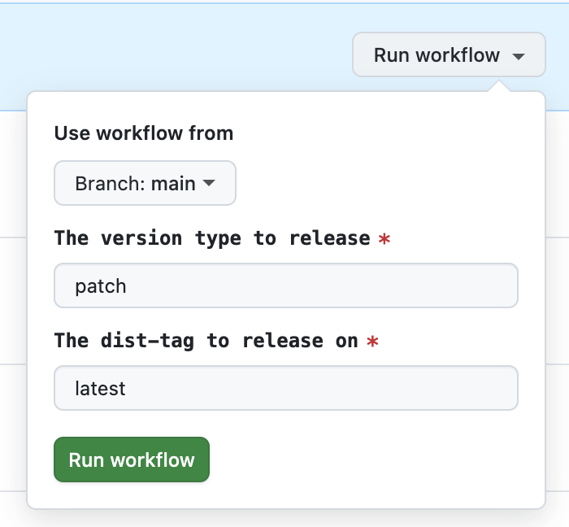
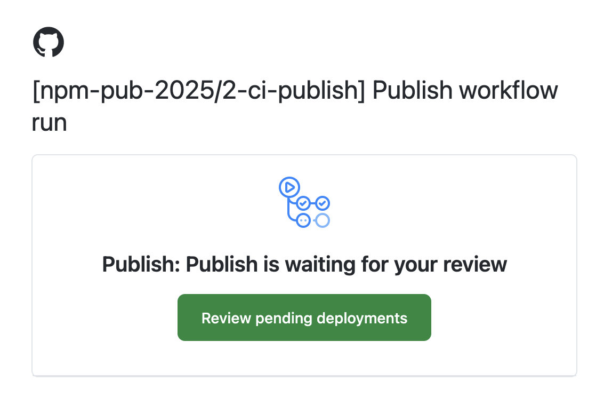

# Publishing a Package from CI with OIDC (Trusted Publisher)

Publishing from CI with OIDC is not yet recommended for general use. We only recommend it for small teams
with dedicated trusted resources able to manage a complicated manual setup process and take a continued strong posture
on securing their CI environment.

If you haven’t read the [Publishing Locally](https://github.com/npm-pub-2025/local-publish) guide yet, do that first.
The steps there for npm account security are always required.

## TL;DR

- Create a GitHub Environment for publishing
- Add required reviewers and disable self review (this second step is *not optional in this workflow*)
- Set up a Trusted Publisher in npmjs.com linked to this workflow and environment
- Take a vigilant stance on securing your CI and project access


## Setup Steps

### 1. Create an environment

For this, see our previous guide on [publishing with CI](https://github.com/npm-pub-2025/ci-publish). The setup for
this is *exactly the same* as step 1 & 2 from that guide.

### 2. Set up the workflow

You can check out the full example here, but these are the main parts:

**NOTE: much of this is the same as when publishing with CI before OIDC/Trusted Publisher**

#### Permissions

```yaml
permissions:
  contents: write
  id-token: write
```

These let the workflow push commits and use secure tokens.

#### Environment

```yaml
environment: publish
```

This connects the workflow to the Environment you made.

#### Latest npm

```yaml
- name: npm i -g npm@latest
  run: npm i -g npm@latest
```

In this example we had to update to latest `npm` so because the version shipped with latest node v24 had not yet adopted
a supporting `npm` version (as of Oct 16th 2025). 

#### Publishing

```yaml
- name: npm publish
  run: npm publish --access=public --tag="${{ inputs.tag }}" --provenance=false
```

This is the normal `npm publish` command, in this case we have to disable provenance because the npm package name does
not match the name of the repository. While we could change the name of the example repo, we wanted to leave this here as an
example of one of the UX/feature gaps in OIDC publishing (as of Nov 11th 2025).

### 3. Set up an OIDC Trusted Publisher

You cannot setup an OIDC Trusted Publisher until you have published at least one version of the package. To get started, we
recommend publishing an initial version using a [local publish workflow](https://github.com/npm-pub-2025/local-publish)
then continue on to the steps below.

When you navigate to the settings page (after your first publish) you will see a section at the top called "Trusted
Publisher", click the "GitHub Actions" button.



Here you will need to copy over the values from your repository. Remember that the `environment` value is **case
sensitive**.



Click "setup connection" and then do your 2FA flow and you should be good to publish and see the below in your settings:



## How to Publish

This workflow uses a manual `workflow_dispatch` trigger. You can change it later if needed.

To publish (this is the same as the first two steps from [publishing with CI](https://github.com/npm-pub-2025/ci-publish)):

1. Go to **Actions → Publish** in GitHub
2. Click **Run workflow**



Your teammates will get an approval request email.



Once approved, the workflow starts. You will see it run right through to publish without intervention.

## Tips for securing GitHub Actions OIDC Trusted Publisher

- Use CI publishing only when you need it. Local publishing is simpler and safer for most projects
- Check your GitHub Actions dependencies often. Specifically ensure any [pinned to commits are not from a fork](https://www.chainguard.dev/unchained/what-the-fork-imposter-commits-in-github-actions-and-ci-cd)
- Consider using [harden-runner](https://github.com/step-security/harden-runner) or a similar endpoint protection tool
  for GitHub Actions runners. It helps control egress traffic and adds useful safeguards to your CI pipeline
- Be sure to *never* run install, tests, or builds in your publish workflow. This can open you to an insecure CI
  environment that could be used to maliciously publish your package (due to the lack of 2FA support, there is no
  stopping someone who gets a foot hold in your CI)

